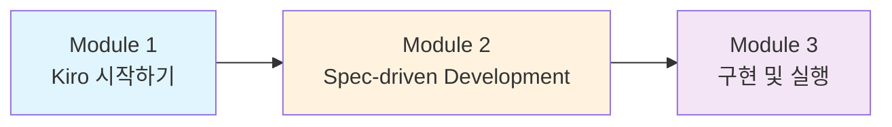

# Kiro Day for GS Retail


**Kiro**는 AWS에서 만든 AI 기반 개발 도구로, 프로토타입에서 프로덕션까지 전체 개발 과정을 지원하는 **Agentic AI IDE**입니다. 단순한 코드 생성을 넘어, **"Spec-driven Development(스펙 기반 개발)"** 방식을 통해 여러분의 자연어 프롬프트를 명확한 요구사항, 시스템 설계, 그리고 구현 태스크로 체계적으로 변환해 줍니다.


## 오늘 만들 것

**GS25 Auto Order** - GS Retail의 편의점(GS25) 발주 자동화 시스템

판매 데이터와 재고 현황을 기반으로 최적의 발주량을 자동 계산하고, 점주가 웹에서 발주를 승인/수정할 수 있는 **풀스택 웹 애플리케이션**을 Kiro와 함께 구축합니다.

## 모듈 구성

| 모듈 | 내용 | 소요 시간 |
|------|------|-----------|
| **Module 1** | Kiro 소개 및 환경 설정 | 20분 |
| **Module 2** | 프롬프트 기반 Spec 개발 (Requirements → Design → Tasks) | 60분 |
| **Module 3** | 태스크 실행 및 애플리케이션 구동 | 60분 |

## 사전 준비

* Kiro IDE 설치: [https://kiro.dev/](https://kiro.dev/)
* Node.js 18+ 설치
* 기본적인 웹 개발 이해 (React, Node.js)


Kiro는 AWS 계정 없이도 로컬 환경에서 실습할 수 있습니다.

