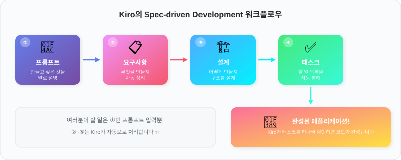
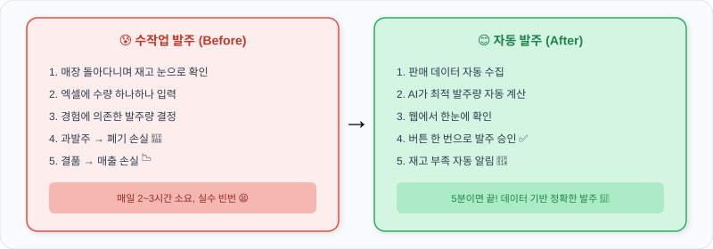

# Kiro Day for GS Retail

## Kiro가 뭔가요?

> **"만들고 싶은 것을 말로 설명하면, Kiro가 코드를 만들어줍니다."**

Kiro는 AWS에서 만든 **AI 개발 도구**입니다. 개발 경험이 없어도, 여러분이 원하는 시스템을 **자연어(한국어)로 설명**하면 Kiro가 알아서 코드를 작성해줍니다.

<figure><figcaption>
여러분은 1번만 하면 됩니다. 나머지는 Kiro가!
</figcaption></figure>


**프롬프트**란? Kiro에게 보내는 메시지를 뜻합니다. 카카오톡처럼 채팅창에 하고 싶은 말을 입력하면 됩니다!


---

## 오늘 만들 것

### Part 1: GS25 발주 자동화 시스템

편의점 점주가 **재고 확인 → 발주량 결정 → 발주 승인**을 수작업으로 하는 대신, 시스템이 자동으로 해주는 **웹 애플리케이션**을 만듭니다.

### Part 2: GS25 AI 매장 도우미

매장 운영 문서를 기반으로 한 **RAG 시스템**을 구축하고, **AI 에이전트**로 점주의 질문에 근거 기반 답변을 제공하는 **채팅봇**을 만듭니다.

<figure><figcaption>
오늘 워크샵이 끝나면 오른쪽 같은 시스템을 갖게 됩니다!
</figcaption></figure>

### 이런 기능이 포함됩니다

| 기능 | 설명 | 누구에게 도움? |
|------|------|---------------|
| 📊 **판매 분석 대시보드** | 어떤 상품이 잘 팔리는지 차트로 확인 | 점주, 본사 |
| 🤖 **자동 발주량 계산** | 7일간 판매 데이터로 최적 수량 추천 | 점주 |
| 📦 **재고 현황 모니터링** | 재고 부족 상품 자동 알림 | 점주 |
| ✅ **발주 승인/수정** | 웹에서 클릭 한 번으로 발주 완료 | 점주 |

---

## 워크샵 진행 순서

| 순서 | 내용 | 소요 시간 | 난이도 |
|------|------|-----------|--------|
| **Module 1** | Kiro 시작하기 - 프롬프트 입력 | 20분 | ⭐ |
| **Module 2** | Spec 문서 자동 생성 | 60분 | ⭐⭐ |
| **Module 3** | 코드 생성 & 실행 | 60분 | ⭐ |
| **Module 4** | RAG 개념 & Knowledge Base 생성 | 30분 | ⭐⭐ |
| **Module 5** | AI 에이전트 & 채팅 UI | 30분 | ⭐⭐ |


**코딩을 몰라도 괜찮아요!** Module 1~3은 Kiro에게 말로 설명하기만 하면 됩니다.



Module 1~3은 AWS 계정 없이 진행 가능하며, Module 4~5는 **AWS 계정**이 필요합니다.


## 시작 전 준비물

1. **Kiro** — AI 개발 도구 ([다운로드](https://kiro.dev/))
2. **Node.js** — 코드 실행 환경 ([다운로드](https://nodejs.org/))
3. **Python 3.10+** — Module 4~5용 ([다운로드](https://www.python.org/downloads/))


설치가 어려우시면 옆 사람이나 진행자에게 도움을 요청하세요! 설치는 5분이면 끝납니다.

