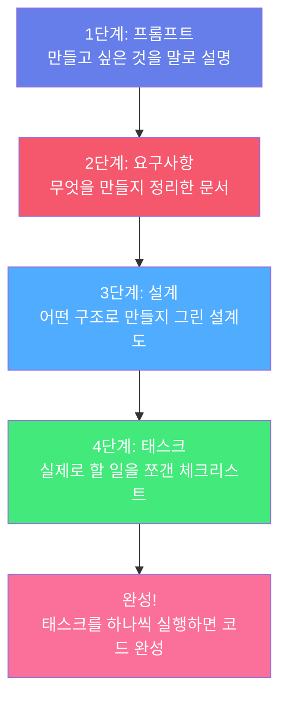

# 워크샵 소개

## 왜 발주 자동화가 필요할까요?

GS Retail은 전국 수천 개의 GS25 편의점을 운영하고 있습니다. 각 매장의 점주들은 **매일** 이런 고민을 합니다:

> _"도시락을 몇 개나 주문해야 하지? 어제 30개 팔렸는데... 오늘은 비가 온다고 하니까 좀 줄일까?"_

이 과정을 수작업으로 하다 보면:

* 😰 **너무 많이 주문** → 유통기한 지나서 버려야 함 (폐기 손실)
* 😰 **너무 적게 주문** → 상품이 없어서 못 팔게 됨 (매출 손실)


**오늘의 목표**: 판매 데이터를 분석해서 **"이 상품은 몇 개를 주문하는 게 좋겠어요"**라고 알려주는 시스템을 만드는 것입니다!


---

## Kiro는 어떻게 도와주나요?

일반적으로 이런 시스템을 만들려면 개발자가 수 주에서 수 개월을 코딩해야 합니다. 하지만 **Kiro를 사용하면 2\~3시간 안에** 만들 수 있습니다!

### Kiro의 작업 방식: "단계별 자동화"

Kiro는 여러분이 한 번에 코드를 만드는 게 아니라, **4단계를 순서대로** 밟아갑니다:

### 쉽게 비유하면...

| Kiro의 단계 | 집 짓기에 비유하면... |
|-------------|---------------------|
| **프롬프트** | "3층짜리 카페를 짓고 싶어요" 라고 건축가에게 말하기 |
| **요구사항** | 건축가가 "몇 평, 좌석 수, 주차장 유무" 등을 정리한 문서 |
| **설계** | 건축 설계 도면 (평면도, 배관도...) |
| **태스크** | 시공 순서 체크리스트 (기초공사 → 골조 → 배관 → 인테리어) |
| **완성** | 카페 오픈! 🎉 |


핵심은 **여러분은 첫 번째 단계(말로 설명하기)만 하면 된다**는 것입니다. 나머지는 Kiro가 자동으로 처리합니다!

