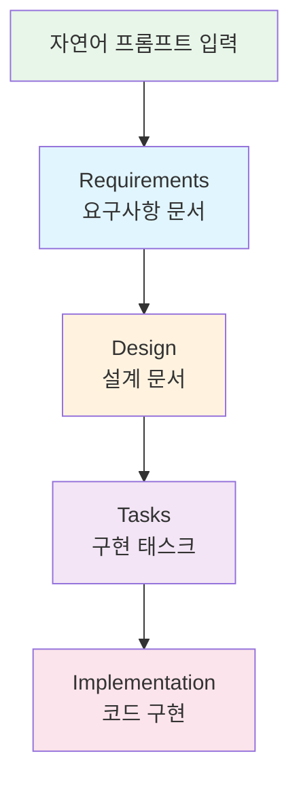

# 워크샵 소개

## 배경

GS Retail은 전국 수천 개의 GS25 편의점을 운영하고 있습니다. 각 매장의 점주들은 매일 상품 재고를 확인하고 발주를 진행해야 합니다. 이 과정은 수작업에 의존하는 경우가 많아, **과발주로 인한 폐기 손실**이나 **결품으로 인한 매출 손실**이 발생할 수 있습니다.

오늘 워크샵에서는 이 문제를 해결하기 위한 **편의점 발주 자동화 시스템**을 Kiro IDE를 사용하여 구축합니다.

## Kiro의 Spec-driven Development

Kiro는 일반적인 AI 코딩 도구와 다릅니다. **Spec-driven Development** 방식을 통해 체계적으로 개발을 진행합니다:

| 단계 | 산출물 | 설명 |
|------|--------|------|
| **Requirements** | `requirements.md` | 프롬프트 기반 요구사항 자동 생성 |
| **Design** | `design.md` | 아키텍처 및 데이터 모델 설계 |
| **Tasks** | `tasks.md` | 구현 태스크 목록 자동 분해 |
| **Implementation** | 소스 코드 | 태스크 기반 코드 자동 생성 |
