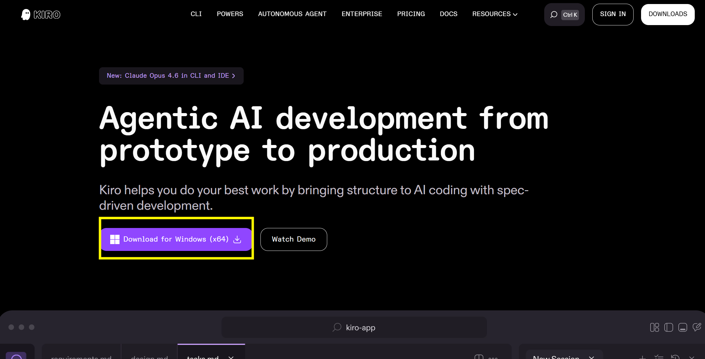

# 환경 준비

## 1단계: Kiro 설치

아래 링크에서 Kiro를 다운로드하고 설치합니다. (일반 프로그램 설치와 동일합니다)

👉 [https://kiro.dev/](https://kiro.dev/)

<figure><figcaption></figcaption></figure>

* 메인 페이지에 보이는 다운로드 버튼을 클릭해 운영체제에 맞는 설치 파일을 다운받습니다.
* 다운로드한 설치 파일을 운영 체제에 맞는 방식으로 실행하여 설치를 시작합니다.
  *

      <div align="left"><figure><figcaption></figcaption></figure></div>

      <div align="left"><figure><figcaption></figcaption></figure></div>

      <div align="left"><figure><figcaption></figcaption></figure></div>


Kiro IDE를 실행하여 정상적으로 설치되었는지 확인합니다.

### Kiro 로그인

Kiro는 다양한 로그인 방법을 제공합니다:

* **Google 계정**
* **GitHub 계정**
* **AWS Builder ID** (무료 생성 가능, 권장)
* **AWS SSO** (조직 계정)

#### AWS Builder ID 로 로그인하기

이번 실습에서는 **AWS Builder ID**를 통해 Kiro에 대한 **무료 액세스**를 제공합니다.

AWS Builder ID는 AWS의 무료 개인 프로필로, AWS 계정 없이도 다양한 AWS 개발자 도구와 서비스를 사용할 수 있게 해줍니다.

**준비물**

* AWS Builder ID 등록을 위한 **유효한 이메일 주소**
* AWS 계정 불필요

#### 1. AWS Builder ID 생성

**1-1.** [AWS Builder ID 등록 페이지 ](https://profile.aws.amazon.com/)를 방문합니다.

<div align="left"><figure><figcaption></figcaption></figure></div>

**1-2.** **유효한 이메일 주소**를 입력한 뒤 **계속** 버튼을 클릭합니다.

**1-3.** 안내에 따라 계정을 생성합니다.

**1-4.** 입력한 이메일 주소를 인증합니다.

**1-5.** 계정 생성을 완료한 후 My details 페이지에서 AWS Builder ID의 세부 내용을 확인하실 수 있습니다.

<div align="left"><figure><figcaption></figcaption></figure></div>


**등록 완료!**

AWS Builder ID가 성공적으로 생성되었습니다! 이제 이 계정으로 Kiro IDE 또는 Kiro CLI에 로그인할 수 있습니다.


#### 2. Kiro IDE 에서 AWS Builder ID로 로그인

**2-1.** Kiro IDE를 실행한 뒤 **Sign in** 버튼을 누릅니다.

<div align="left"><figure><figcaption></figcaption></figure></div>

**2-2.** 로그인 화면에서 **"AWS Builder ID"** 옵션을 선택합니다.

<div align="left"><figure><figcaption></figcaption></figure></div>

**2-3.** 방금 생성한 AWS Builder ID의 **이메일 주소**와 **비밀번호**를 입력하여 로그인을 진행합니다.

**2-4.** 필요한 경우 이메일로 전송된 추가 인증 코드를 입력합니다.

**2-5.** **"액세스 허용"** 버튼을 클릭하여 Kiro IDE가 데이터에 액세스하도록 허용합니다.

<div align="left"><figure><figcaption></figcaption></figure></div>

**2-6.** 모든 과정이 끝나면 Kiro를 사용할 준비가 끝납니다.

<div align="left"><figure><figcaption></figcaption></figure></div>


**축하드립니다!**\
Kiro에 성공적으로 로그인했습니다! 이제 AI와 협업하는 개발 경험을 시작할 준비가 되었습니다.



Kiro는 Visual Studio Code(VS Code)와 비슷하게 생긴 프로그램입니다. 처음 보셔도 당황하지 마세요! 우리가 사용할 것은 **채팅창**뿐입니다.


***

## 2단계: Node.js 설치 확인

Node.js는 우리가 만들 프로그램을 실행하기 위해 필요한 도구입니다.

이미 설치되어 있는지 확인하는 방법:

```bash
node --version
```


터미널(또는 명령 프롬프트)에 위 명령어를 입력했을 때 `v18` 이상의 숫자가 나오면 준비 완료입니다! 만약 "command not found"가 뜨면 [https://nodejs.org/](https://nodejs.org/) 에서 설치해주세요.



**어디에 어떻게 명령어를 입력해야 할 지 모르시겠다면,&#x20;**<mark style="color:purple;">**Kiro 에게 설치를 맡겨도 됩니다!**</mark>

<mark style="color:purple;">**채팅 창에 아래와 같이 입력해보세요!**</mark>

```powershell
node --version 확인하고 없으면 설치해줘.
```

.png>) (1).png>) (1).png>) (1).png>)


***

## 3단계: Python 설치 확인 (Module 4\~5용)

```bash
python3 --version   # Mac/Linux
python --version    # Windows
```


`v3.10` 이상이어야 합니다. 설치가 안 되어 있으면 [https://www.python.org/downloads/](https://www.python.org/downloads/) 에서 설치하세요. Windows에서는 설치 시 **"Add python.exe to PATH"** 체크박스를 반드시 선택하세요!



**잘 모르시겠다면 이 경우에도 역시&#x20;**<mark style="color:purple;">**Kiro 에게 설치를 맡기시면 됩니다!**</mark>

<mark style="color:purple;">**채팅 창에 아래와 같이 입력해보세요!**</mark>

```powershell
python --version 확인하고 없으면 설치해줘.
```

 (1).png>) (1).png>) (1).png>)


***

## 4단계: Kiro에서 새 프로젝트 시작

1. Kiro를 실행합니다
2. **File → Open Folder** (또는 폴더 열기)를 클릭합니다
3. 바탕화면 등 원하는 곳에 **새 폴더**를 만들고 선택합니다 (예: `gs25-auto-order`)
4. 왼쪽에 **채팅 패널**이 보이면 준비 완료!


설치가 모두 끝났으면, 다음 단계에서 Kiro에게 첫 메시지를 보내봅시다! 🚀 (Part 1은 AWS 계정 없이 진행 가능하며, Part 2부터 AWS 계정이 필요합니다)

