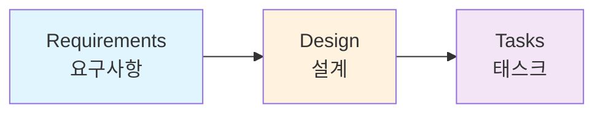

# Module 2: Spec-driven Development

이 모듈에서는 Kiro의 핵심 기능인 **Spec-driven Development**를 실습합니다. 자연어 프롬프트를 통해 Requirements → Design → Tasks 문서를 순차적으로 생성합니다.

## 학습 목표

* Kiro의 Spec-driven Development 워크플로우 체험
* 요구사항(Requirements) 문서 자동 생성 및 검토
* 설계(Design) 문서 자동 생성 및 데이터 모델 상세화
* 구현 태스크(Tasks) 자동 분해

## Spec 생성 흐름

## 모듈 구성

1. [Requirements - 요구사항 문서](requirements.md) — 요구사항 문서 생성 및 검토
2. [Design - 설계 문서](design.md) — 아키텍처 설계 및 데이터 모델링
3. [Tasks - 구현 태스크](tasks.md) — 태스크 정의 및 실행 준비
