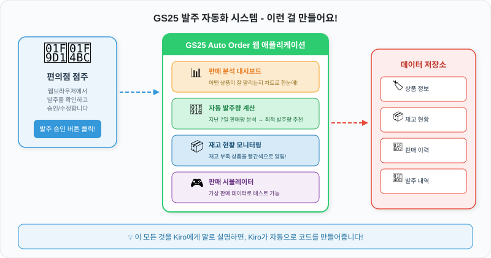

# Design - 설계 문서 생성

## 설계 문서란?

> "요구사항을 실제로 어떻게 구현할 것인가"를 정리한 설계도입니다.

건축에 비유하면, "3층 카페를 짓겠다"(요구사항)를 바탕으로 **평면도, 배관도, 전기 도면**을 그리는 과정입니다.

## 프롬프트 보내기


```
이대로 디자인 문서를 만들어주세요.
```


Kiro가 `requirements.md`를 읽고, `design.md` 파일을 자동으로 생성합니다.

## 생성되는 설계도

우리 시스템은 크게 **3개 층**으로 구성됩니다:

<figure><figcaption><p>점주가 웹 화면에서 조작하면, 서버가 데이터를 처리하고, 데이터베이스에 저장됩니다</p></figcaption></figure>


**쉽게 이해하기**: 웹 화면(Frontend)은 식당의 **홀**, 서버(Backend)는 **주방**, 데이터베이스는 **냉장고**입니다. 손님(점주)이 홀에서 주문하면, 주방에서 요리하고, 재료는 냉장고에서 꺼내옵니다.


## (선택) 데이터 구조를 더 구체적으로 알려주기

시간이 충분하다면, 각 테이블의 상세 구조를 Kiro에게 직접 알려줄 수 있습니다. **건너뛰어도 괜찮습니다!**

<details>

<summary>📋 데이터 모델 상세화 프롬프트 (선택 - 클릭해서 펼치기)</summary>


```
1. product 테이블 - 용도: 상품 등록 정보 및 기본 메타데이터 관리
Primary Key:
  - product_id (String)

속성:
  - name (String): 상품명
  - category (String): 카테고리 (도시락/음료/과자/생활용품)
  - price (Number): 단가
  - min_stock (Number): 최소 유지 재고량
  - supplier (String): 공급업체명

2. inventory 테이블 - 용도: 현재 재고 상태
Primary Key:
  - product_id (String)

속성:
  - current_stock (Number): 현재 재고 수량
  - last_inbound_date (String): 최근 입고일
  - last_outbound_date (String): 최근 출고일

3. order 테이블 - 용도: 발주 이력 관리
Primary Key:
  - order_id (String)

속성:
  - product_id (String): 상품코드
  - quantity (Number): 발주 수량
  - status (String): 상태 (pending/approved/cancelled)
  - created_at (String): 생성일시 (ISO 8601)
```


</details>


설계 문서가 만들어졌으면, 이제 마지막 단계인 **태스크 문서**를 만들 차례입니다!

