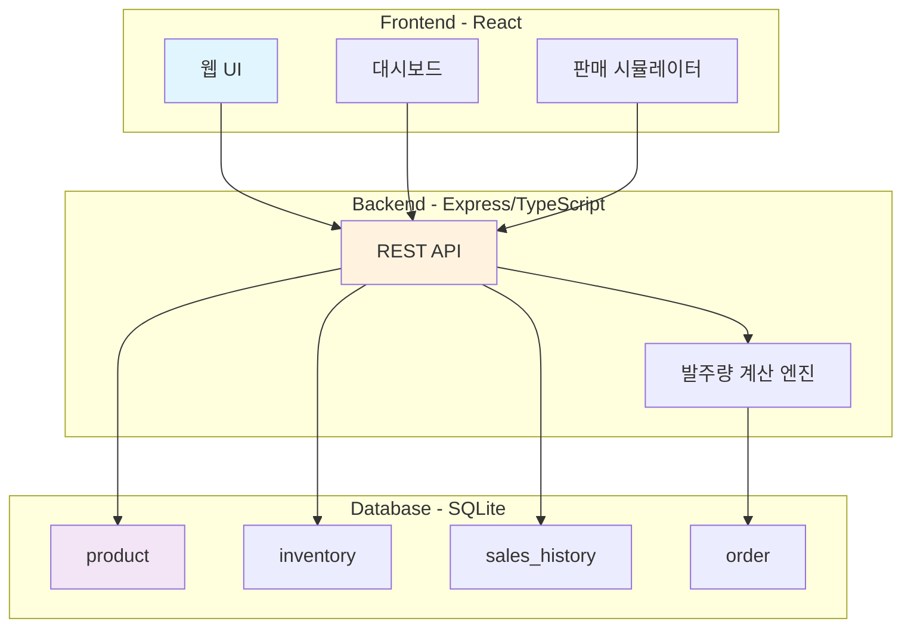

# Design - 설계 문서 생성

## 디자인 문서 작성 요청

요구사항 문서가 완성되었으면, Kiro에게 설계 문서 작성을 요청합니다.


```
이대로 디자인 문서를 만들어주세요.
```


Kiro가 `requirements.md`를 기반으로 `design.md` 파일을 자동 생성합니다.

## (선택) 데이터 모델 상세화

더 정확한 설계를 위해, 데이터 모델을 직접 상세하게 지정할 수 있습니다. 아래 프롬프트는 **선택 사항**입니다.

<details>

<summary>데이터 모델 상세화 프롬프트 (선택)</summary>


```
1. product 테이블 - 용도: 상품 등록 정보 및 기본 메타데이터 관리
Primary Key:
  - product_id (String)

속성:
  - name (String): 상품명
  - category (String): 카테고리 (도시락/음료/과자/생활용품)
  - price (Number): 단가
  - min_stock (Number): 최소 유지 재고량
  - supplier (String): 공급업체명

2. inventory 테이블 - 용도: 현재 재고 상태
Primary Key:
  - product_id (String)

속성:
  - current_stock (Number): 현재 재고 수량
  - last_inbound_date (String): 최근 입고일
  - last_outbound_date (String): 최근 출고일

3. order 테이블 - 용도: 발주 이력 관리
Primary Key:
  - order_id (String)

속성:
  - product_id (String): 상품코드
  - quantity (Number): 발주 수량
  - status (String): 상태 (pending/approved/cancelled)
  - created_at (String): 생성일시 (ISO 8601)
```


</details>

## 생성되는 설계 문서 확인

`design.md` 파일에는 다음 내용이 포함됩니다:



### 설계 문서 주요 섹션

| 섹션 | 내용 |
|------|------|
| 시스템 아키텍처 | Frontend/Backend/Database 구조 |
| API 설계 | REST 엔드포인트 정의 |
| 데이터 모델 | 테이블 스키마 상세 |
| 컴포넌트 설계 | React 컴포넌트 구조 |
| 디렉토리 구조 | 프로젝트 폴더 레이아웃 |
