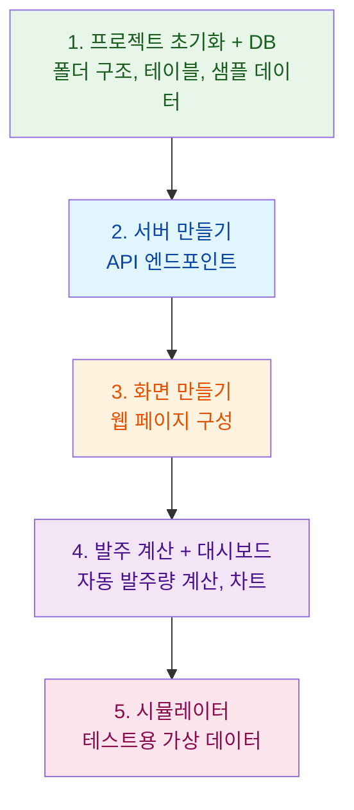

# Tasks - 구현 태스크

## 태스크 문서란?

> "설계도를 보고 실제로 만들 때, 어떤 순서로 뭘 만들지" 체크리스트입니다.

건축에 비유하면, 설계도가 완성된 후 **시공 순서표**를 만드는 것입니다: "1주차: 기초공사 → 2주차: 골조 → 3주차: 배관..."

## 프롬프트 보내기


```
Task를 5개로 정의해주세요.
```


Kiro가 `design.md`를 읽고, `tasks.md` 파일을 자동으로 생성합니다.

## 이런 태스크들이 만들어집니다

Kiro가 프로젝트를 **5개의 할 일**로 쪼갭니다:




**태스크는 5개로 제한**합니다. 너무 많으면 실습 시간 안에 완성하기 어렵기 때문입니다. 태스크의 세부 내용은 Kiro가 자동으로 결정하므로 실습하는 분마다 조금씩 다를 수 있어요.


## 태스크 문서 간단 확인

`tasks.md` 파일이 만들어지면, 이런 것들을 확인해보세요:

* ☐ 각 태스크 앞에 **체크박스** `[ ]`가 있는지 → 이걸 클릭하면 Kiro가 해당 태스크를 실행합니다!
* ☐ 태스크 순서가 논리적인지 (DB 먼저, 그 다음 서버, 그 다음 화면)
* ☐ 우리가 요청한 기능(발주, 대시보드, 시뮬레이터)이 다 포함되어 있는지


**‼️ 태스크가 5개가 아니라면? "**<mark style="color:orange;">**태스크를 5개로 통합해주세요**</mark>**"라고 Kiro에게 말하면 됩니다.**



🎉 **3개 문서(요구사항, 설계, 태스크)가 모두 완성되었습니다!** 다음 모듈에서는 태스크를 실행해서 실제 코드를 만들어봅시다!

