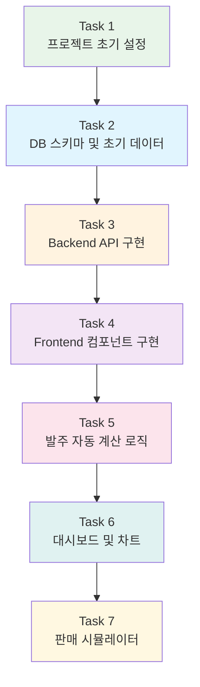

# Tasks - 구현 태스크 정의

## 태스크 문서 작성 요청

설계 문서가 완성되었으면, Kiro에게 구현 태스크를 정의하도록 요청합니다.


```
Task를 정의해주세요.
```


Kiro가 `design.md`를 기반으로 `tasks.md` 파일을 자동 생성합니다.

## 생성되는 태스크 구조

Kiro는 설계 문서를 분석하여 구현에 필요한 태스크를 자동으로 분해합니다. 일반적으로 다음과 같은 태스크들이 생성됩니다:



### 예상 태스크 목록

| 태스크 | 설명 |
|--------|------|
| 프로젝트 초기화 | package.json, TypeScript 설정, 디렉토리 구조 |
| DB 스키마 생성 | SQLite 테이블 생성 및 시드 데이터 |
| REST API 구현 | 상품/재고/발주/판매 CRUD 엔드포인트 |
| Frontend 구현 | React 컴포넌트 및 라우팅 |
| 발주 계산 엔진 | 7일 판매 데이터 기반 자동 발주량 계산 |
| 대시보드 | Chart.js 기반 판매 분석 차트 |
| 판매 시뮬레이터 | 가상 판매 데이터 생성 기능 |


태스크의 수와 내용은 Kiro가 자동으로 결정하므로, 실습자마다 다를 수 있습니다.


## 태스크 문서 검토

`tasks.md` 파일이 생성되면 다음을 확인합니다:

* 각 태스크에 체크박스(`[ ]`)가 있는지
* 태스크 간 의존성이 합리적인지
* 누락된 기능이 없는지


태스크가 너무 많거나 세분화되어 있다면, Kiro에게 "태스크를 좀 더 통합해주세요"라고 요청할 수 있습니다.

