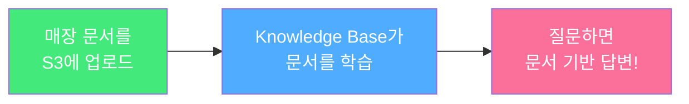

# 모듈 개요

## 이 모듈에서 할 것

Part 1에서 GS25 발주 자동화 시스템을 만들었죠? 이제 **AI가 매장 운영 문서를 읽고 질문에 답변해주는 시스템**을 만들 차례입니다!




**이 모듈부터는 AWS 계정이 필요합니다!** Amazon Bedrock에서 모델 액세스를 미리 활성화해주세요.


## 사전 준비: Bedrock 모델 액세스 활성화

1. AWS 콘솔에서 **Amazon Bedrock** 서비스로 이동 (리전: **us-east-1**)
2. 좌측 메뉴에서 **Model access** 클릭
3. 아래 모델들의 액세스를 활성화:
   * **Anthropic > Claude Sonnet 4** (또는 Claude 3.5 Haiku)
   * **Amazon > Titan Text Embeddings V2**

## 사전 준비: AWS CLI 설정

Module 5에서 Python 코드로 AWS 서비스를 호출하려면 로컬에 AWS 자격 증명이 필요합니다.

```bash
aws configure
# AWS Access Key ID: [본인의 Access Key]
# AWS Secret Access Key: [본인의 Secret Key]
# Default region name: us-east-1
# Default output format: json
```


AWS Access Key가 없다면 IAM 콘솔에서 **사용자 > 보안 자격 증명 > 액세스 키 만들기**로 생성할 수 있습니다.

AWS Event Workshop 에 참여하고 계신 분들께서는 아래와 같이 자격 증명을 획득하세요.

* Workshop Studio 콘솔로 돌아갑니다.
* 좌측 메뉴에서 **"Get AWS CLI credentials"** 메뉴를 클릭합니다.
* 다음 정보를 확인하고 복사하여 메모장에 저장해둡니다:
  * **AWS Access Key ID**: `ASIA...`로 시작하는 키
  * **AWS Secret Access Key**: 비밀 액세스 키
  * **AWS Session Token**: 임시 세션 토큰 (있는 경우)
  * **AWS Default Region**: 리전 정보 (예: `us-east-1`)

.png>) (1).png>)


## 모듈 구성

1. [RAG 개념 이해](rag-concepts.md) — AI가 문서를 참고해서 답변하는 원리
2. [Knowledge Base 생성](create-kb.md) — AWS 콘솔에서 직접 만들기
3. [Knowledge Base 테스트](test-kb.md) — 질문을 던져서 확인하기
