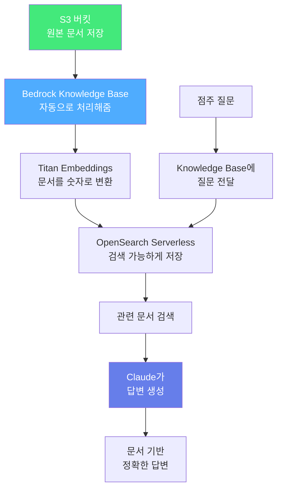

# RAG 개념 이해

## AI(LLM)는 만능이 아닙니다

ChatGPT나 Claude 같은 AI 모델은 똑똑하지만, **모르는 것도 있습니다**:

| 한계 | 예시 |
|------|------|
| **최신 정보를 모름** | "오늘 GS25 신상 도시락이 뭐야?" → 모름 |
| **우리 회사 내부 정보를 모름** | "발주 승인 절차가 어떻게 돼?" → 모름 |
| **모르면서 아는 척함 (환각)** | 그럴듯하지만 틀린 답변을 생성 |

> 예를 들어 "GS25에서 가장 잘 팔리는 도시락은?"이라고 물으면, AI는 **실제 데이터 없이 추측**으로 답변합니다. 이건 위험하죠!

---

## RAG가 뭔가요?

**RAG (Retrieval-Augmented Generation)** = AI가 답변하기 전에 **관련 문서를 먼저 찾아보는 것**

쉽게 말하면, **오픈북 시험**입니다:

| | 일반 AI | RAG를 사용한 AI |
|---|---------|----------------|
| **비유** | 암기만으로 시험 보기 | 교과서 펴놓고 시험 보기 |
| **답변 근거** | 학습할 때 본 것만 | 실제 문서에서 찾은 내용 |
| **정확도** | 추측 가능 | 문서 기반 (출처 제공) |


---

## RAG는 어떻게 동작하나요?

### 1단계: 문서 준비 (한 번만 하면 됨)

문서를 AI가 검색할 수 있도록 미리 처리합니다:

```
원본 문서 (발주 정책.pdf, 상품 목록.md 등)
    ↓
문서를 작은 조각으로 나누기 (청킹)
    ↓
각 조각을 숫자로 변환 (임베딩)
    ↓
벡터 데이터베이스에 저장
```

<details>
<summary>용어가 어렵다면? 클릭해서 쉬운 설명 보기</summary>

| 용어 | 쉬운 설명 |
|------|-----------|
| **청킹 (Chunking)** | 긴 문서를 의미 있는 단락으로 나누는 것. 책을 챕터별로 나누는 것과 같아요 |
| **임베딩 (Embedding)** | 텍스트를 숫자 배열로 변환하는 것. 컴퓨터가 "의미가 비슷한 문장"을 찾을 수 있게 해줍니다 |
| **벡터 데이터베이스** | 임베딩된 숫자들을 저장하고 빠르게 검색하는 창고 |

</details>

### 2단계: 질문 → 검색 → 답변 (매번 반복)

1. 점주가 질문: "도시락 발주량 계산법이 뭐야?"
2. 질문과 **의미가 비슷한 문서 조각**을 벡터 데이터베이스에서 찾음
3. 찾은 문서를 AI에게 "이거 참고해서 답변해"라고 전달
4. AI가 **문서 내용을 근거로** 정확하게 답변

---

## Amazon Bedrock Knowledge Base

위의 복잡한 과정을 **AWS가 알아서 해주는 서비스**가 바로 Amazon Bedrock Knowledge Base입니다!



### 주요 구성 요소

| 구성 요소 | 역할 | 쉬운 비유 |
|-----------|------|-----------|
| **Amazon S3** | 원본 문서 저장 | 서류 캐비닛 |
| **Titan Embeddings** | 문서를 숫자로 변환 | 도서관 색인 카드 작성 |
| **OpenSearch Serverless** | 빠른 검색 | 도서관 검색 시스템 |
| **Claude** | 검색 결과로 답변 생성 | 사서가 찾아서 설명해주기 |

### RAG가 없을 때 vs 있을 때

| | RAG 없음 | RAG 있음 |
|---|----------|----------|
| **질문** | "GS25 도시락 할인 행사는?" | "GS25 도시락 할인 행사는?" |
| **답변** | "정확한 정보를 알기 어렵습니다..." | "김치찌개 도시락이 20% 할인 중입니다 (출처: 주간\_프로모션.pdf)" |
| **근거** | 없음 | 문서 기반 출처 제공 |


RAG를 사용하면 AI가 **우리 회사 문서에 근거한 정확한 답변**을 해주고, **출처까지 알려줍니다!**

