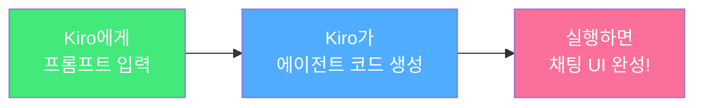

# Module 5: Strands RAG 에이전트

## 이 모듈에서 할 것

Module 4에서 만든 Knowledge Base를 활용하는 **AI 채팅 에이전트**를 만듭니다. Module 1~3에서 했던 것처럼, **Kiro에게 말로 설명하면 Kiro가 코드를 만들어줍니다!**


Part 1에서 Kiro로 웹 애플리케이션을 만들었던 것처럼, 이번에도 **Kiro 채팅창에 프롬프트를 입력하는 것만으로** AI 에이전트를 만듭니다!


## 사전 준비

* Python 3.10+ 설치
* AWS CLI 설정 완료 (Module 4에서 했음)
* Module 4에서 메모한 **Knowledge Base ID**

## 모듈 구성

1. [Strands Agent 소개](strands-intro.md) — AI 에이전트가 뭔지 알아보기
2. [Kiro로 RAG 에이전트 만들기](rag-agent.md) — Kiro에게 프롬프트로 요청하기
3. [채팅 UI 실행](chat-ui.md) — 에이전트와 대화하기
