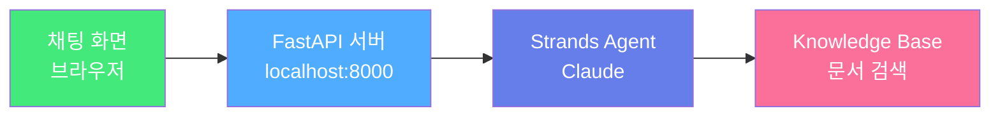

# Module 5: Strands RAG 에이전트

## 이 모듈에서 할 것

Module 4에서 만든 Knowledge Base를 **AI 에이전트에 연결**하고, **예쁜 채팅 화면**에서 점주처럼 질문해봅니다!

## 사전 준비

* Python 3.10+ 설치
* AWS CLI 설정 완료 (Module 4에서 했음)
* Module 4에서 메모한 **Knowledge Base ID**

## 모듈 구성

1. [Strands Agent 소개](strands-intro.md) — AI 에이전트가 뭔지 알아보기
2. [RAG 에이전트 구현](rag-agent.md) — 코드 작성하기
3. [채팅 UI 실행](chat-ui.md) — 예쁜 화면에서 대화하기
