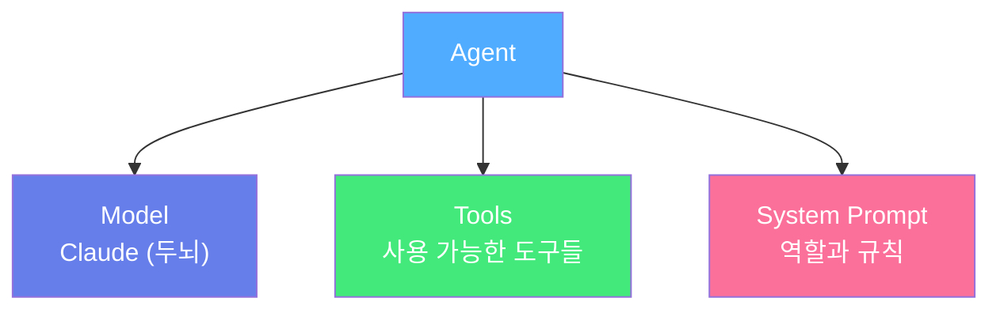
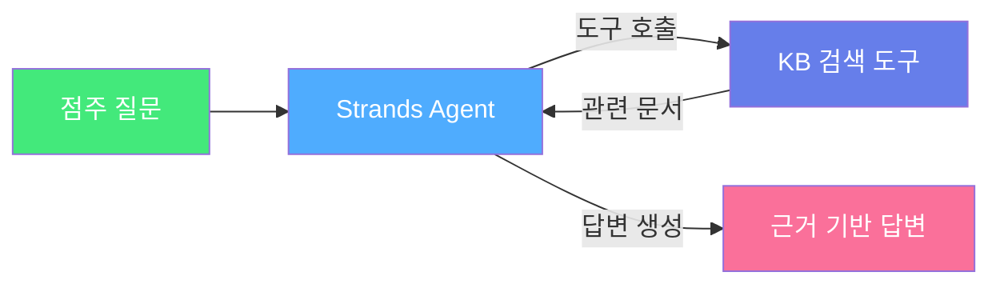

# Strands Agent 소개

## Strands Agents SDK란?

**Strands Agents SDK**는 AWS에서 만든 **오픈소스 AI 에이전트 프레임워크**입니다.

> 쉽게 말하면, AI에게 **"도구를 사용하는 능력"**을 부여하는 도구입니다.

단 몇 줄의 코드로 도구를 쓰는 AI 에이전트를 만들 수 있습니다:

```python
from strands import Agent

agent = Agent(system_prompt="You are a helpful assistant.")
response = agent("안녕하세요!")
print(response)
```

---

## 핵심 개념 3가지

### 1. Agent (에이전트)

에이전트 = **AI 모델 + 도구 + 역할 설명**의 조합



| 구성 요소 | 쉬운 설명 |
|-----------|-----------|
| **Model** | AI의 두뇌 (Claude) |
| **Tools** | AI가 사용할 수 있는 기능들 (검색, 계산 등) |
| **System Prompt** | "너는 GS25 매장 도우미야"라는 역할 부여 |

### 2. Tool (도구)

에이전트가 **외부 시스템과 상호작용**하기 위한 함수입니다. Python 함수에 `@tool`만 붙이면 끝!

```python
from strands import tool

@tool
def get_weather(city: str) -> str:
    """주어진 도시의 날씨를 조회합니다."""
    return f"{city}의 현재 날씨: 맑음, 22도"
```


우리는 **Knowledge Base 검색 도구**를 만들 것입니다. 에이전트가 질문을 받으면 이 도구를 사용해서 문서를 찾아보고 답변합니다!


### 3. Agentic Loop (에이전트 루프)

에이전트는 이런 과정을 반복합니다:

```
1. 사용자 질문 수신
2. "이 질문에 답하려면 어떤 도구가 필요하지?" 판단
3. 도구 호출 (예: Knowledge Base 검색)
4. 도구 결과를 받아서 분석
5. 추가 정보가 필요하면 다시 3번으로
6. 충분한 정보가 모이면 최종 답변 생성
```

---

## 우리가 만들 에이전트

**GS25 매장 운영 도우미** 에이전트:

* **두뇌**: Amazon Bedrock의 Claude
* **도구**: Knowledge Base 검색 (Module 4에서 만든 것)
* **역할**: 매장 운영, 발주, 상품 질문에 답변




개념을 파악했으면, 다음 단계에서 실제 코드를 작성해봅시다!

