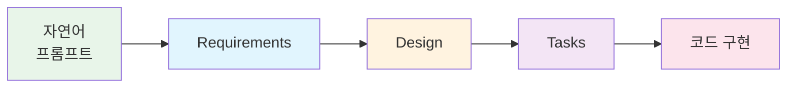

# 워크샵 마무리

## 결과물


모든 사람이 동일한 결과를 얻지 못합니다. Kiro의 AI가 생성하는 코드는 매번 다를 수 있으며, 이는 정상입니다.


오늘 워크샵에서 Kiro와 함께 만든 결과물:

| 산출물 | 파일 | 설명 |
|--------|------|------|
| 요구사항 문서 | `requirements.md` | 편의점 발주 자동화 시스템 요구사항 |
| 설계 문서 | `design.md` | 시스템 아키텍처 및 데이터 모델 |
| 태스크 문서 | `tasks.md` | 구현 태스크 목록 |
| 소스 코드 | `src/` | 풀스택 웹 애플리케이션 코드 |

## 오늘 배운 것

### Kiro의 Spec-driven Development

1. **프롬프트 → 요구사항**: 자연어로 프로젝트를 설명하면 구조화된 요구사항 문서 생성
2. **요구사항 → 설계**: 요구사항을 기반으로 아키텍처 및 데이터 모델 설계
3. **설계 → 태스크**: 설계를 구현 가능한 태스크로 자동 분해
4. **태스크 → 코드**: 각 태스크를 실행하여 실제 코드 생성

### 핵심 포인트

* Kiro는 단순 코드 생성이 아닌 **체계적인 개발 프로세스**를 지원합니다
* 프롬프트를 **단계별로 구체적**으로 입력할수록 더 좋은 결과를 얻습니다
* 생성된 Spec 문서는 **팀 협업과 코드 리뷰**에 활용할 수 있습니다
* 로컬 환경에서 시작하여 **AWS 인프라로 점진적 전환**이 가능합니다

## 다음 단계

오늘 만든 로컬 환경 애플리케이션을 AWS 인프라로 전환한다면:

| 로컬 환경 | AWS 전환 |
|-----------|----------|
| SQLite | Amazon DynamoDB |
| Express Server | AWS Lambda + API Gateway |
| React (localhost) | S3 + CloudFront |
| 로컬 시뮬레이터 | Amazon EventBridge + Lambda |

## 리소스

* Kiro 공식 사이트: [https://kiro.dev/](https://kiro.dev/)
* Kiro 문서: [https://kiro.dev/docs/](https://kiro.dev/docs/)


워크샵에 참여해주셔서 감사합니다!

